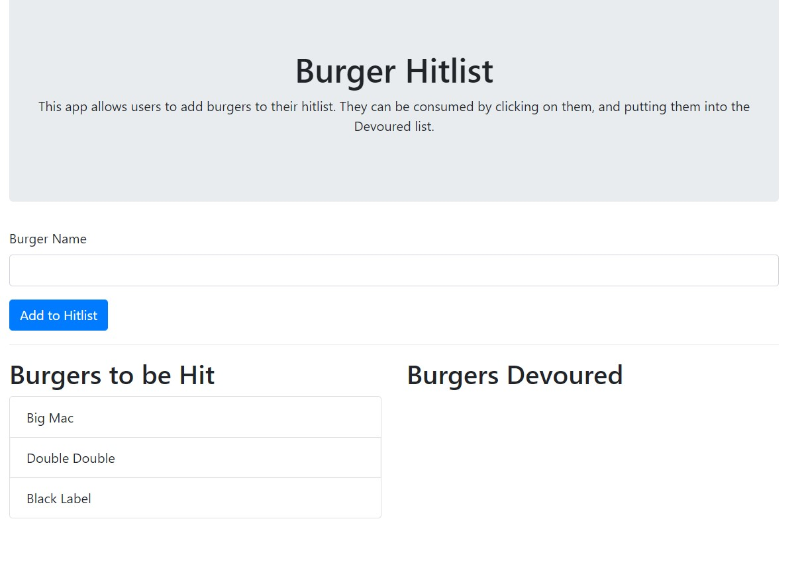
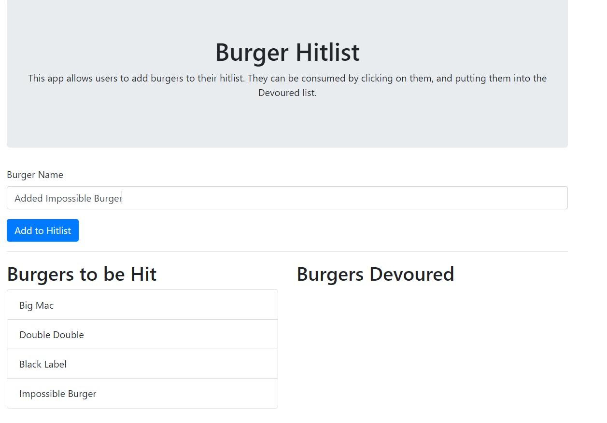
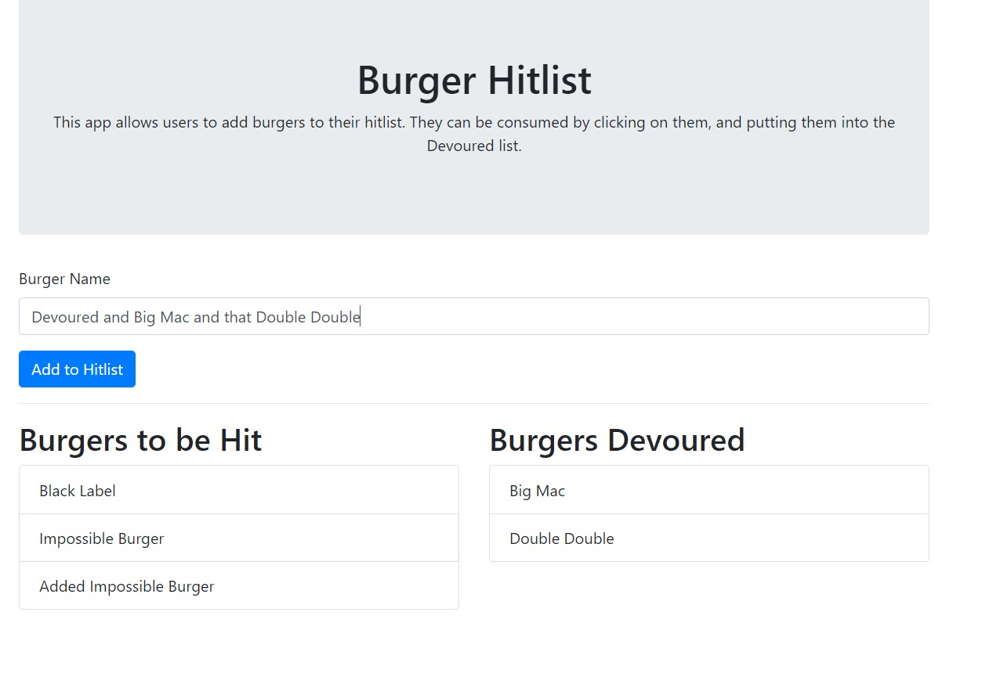

# burger-hitlist

Homework13 - Makoto Asahi

Deployed Heroku Link: 
https://blooming-crag-23655.herokuapp.com/

# Description

This app will track a user's burger list.

Add a burger to the list by entering a burger name.

Clicking a listed burger on the left will devour it and send it to the right column.

# Installation

This app can be run locally as well.

Run `npm i` to download all dependencies needed for this app.

The config folder has connection.js. Be sure to properly link the connection with the user mySQL connection.

The db folder has the schema and seeds for the initial setup of the database.

# Usage

Make a hitlist for burgers with high bounties.

Devour them once you click on them in the list on the left.

